# Lumen

A full-stack e-commerce app — customers browse products, check out with coupons, and track orders, while admins manage the entire store from a dashboard.

**Repository:** [https://github.com/Wynnwrath/Lumen](https://github.com/Wynnwrath/Lumen)

## Features

- Storefront product browsing with filters and sorting
- Product detail pages
- Persistent cart backed by Zustand + `localStorage`
- Coupon checkout with server-side validation
- Order placement via a transactional checkout flow
- Order tracking with status timeline, delivery confirmation, and reorder
- Admin dashboard with KPIs and charts
- Product, category, and coupon CRUD
- Browsable customer list for admins
- Order management with CSV export
- Role-based auth (customer vs. admin)

## Screenshots

Captured from the local dev environment (desktop 1440×900, mobile 390×844).

| Screen | Desktop | Mobile |
| --- | --- | --- |
| Home | 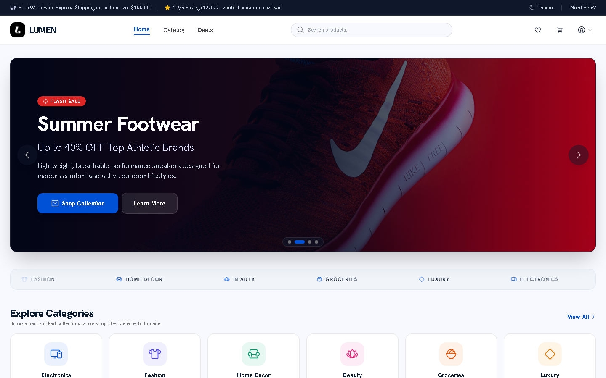 | 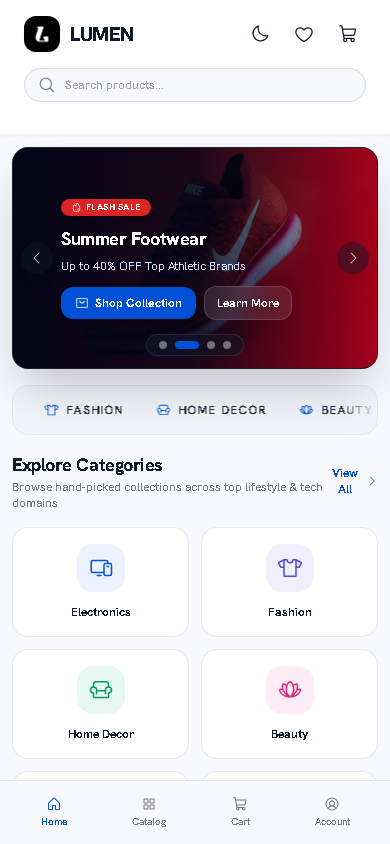 |
| Products | 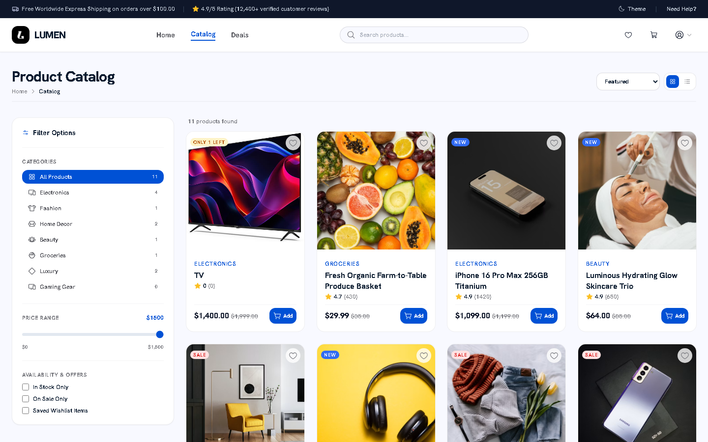 | 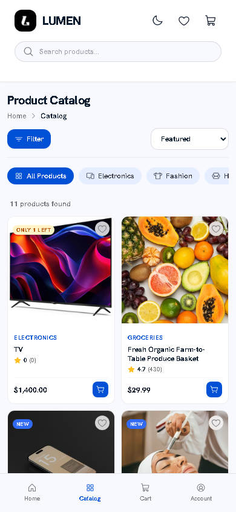 |
| Product detail | 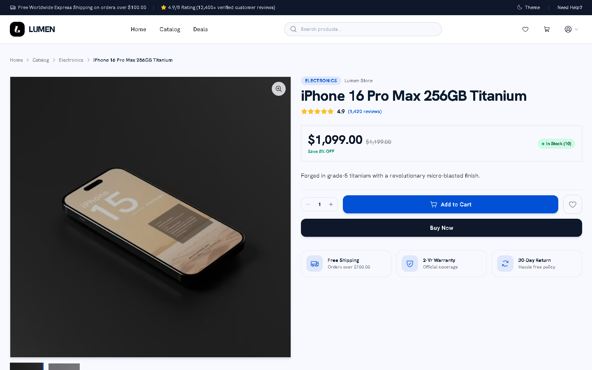 | 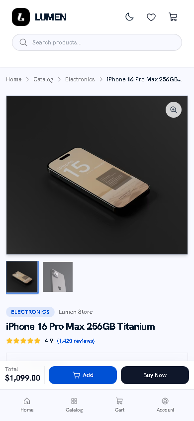 |
| Cart | 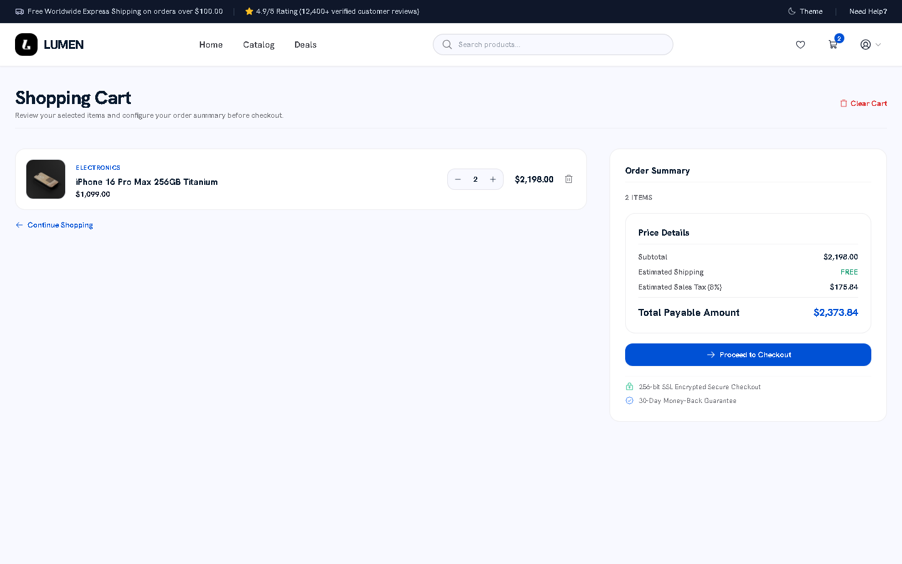 | 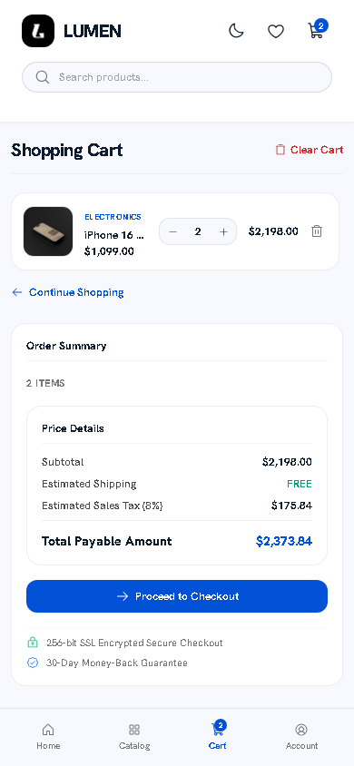 |
| Checkout | 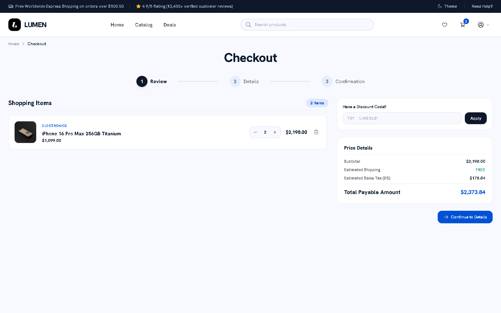 | 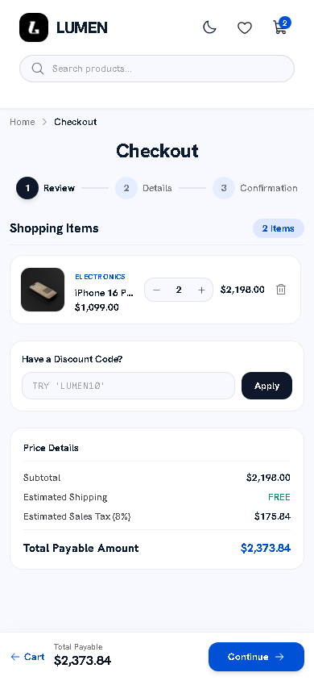 |
| My Orders | 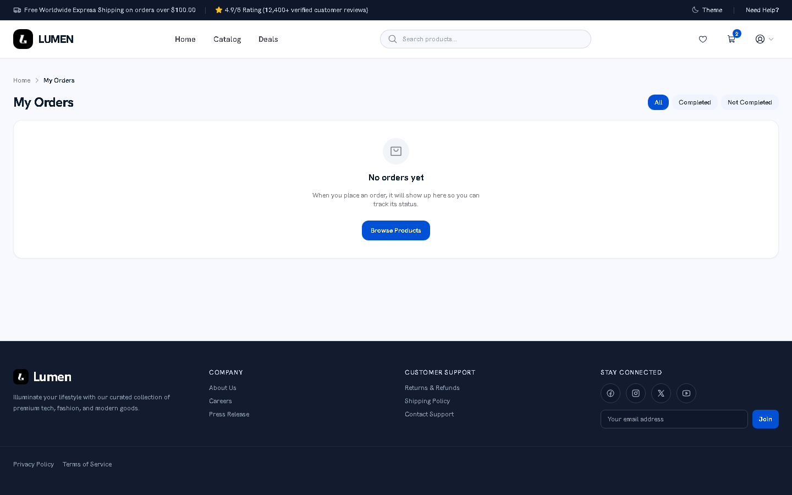 | 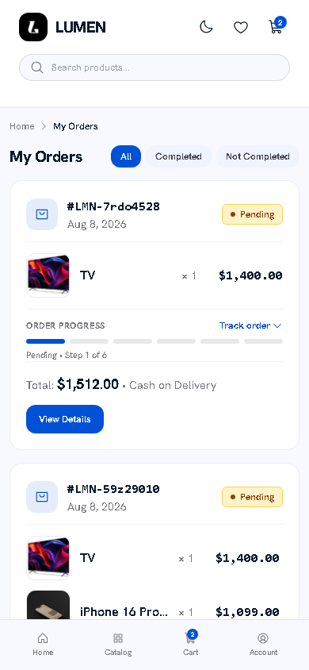 |
| Admin Dashboard | 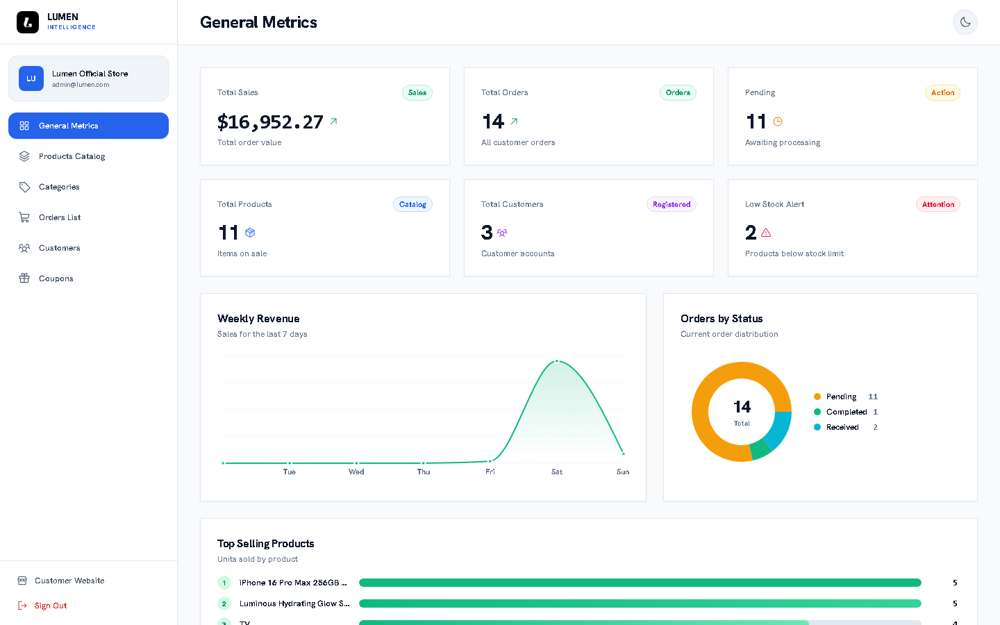 | |
| Admin Products | 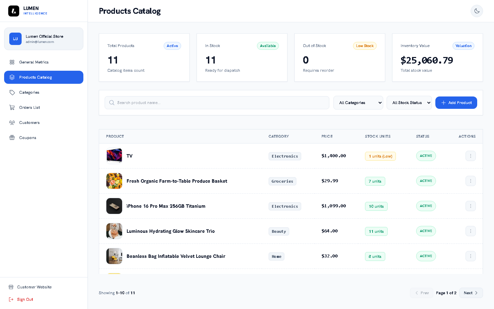 | |
| Admin Orders | 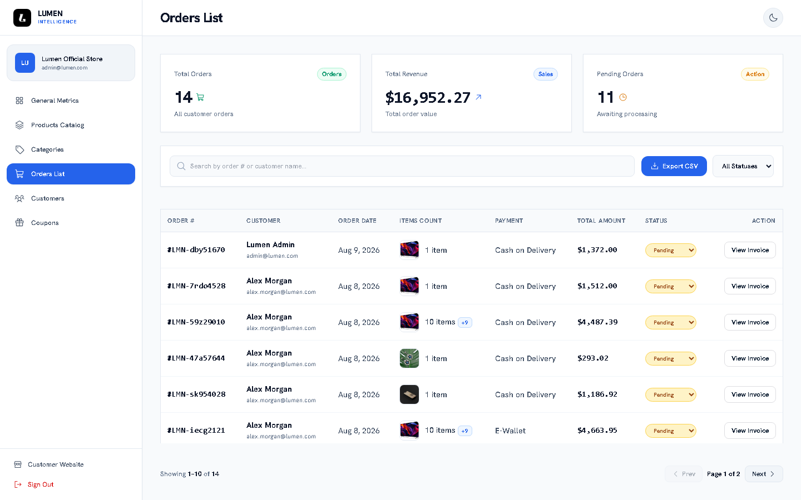 | |

## Tech Stack

**Frontend** (`client/`)

| Technology | Purpose |
| --- | --- |
| React 18 | UI library |
| TypeScript | Typed JavaScript |
| Vite 5 | Build tool and dev server |
| Tailwind CSS 3 | Styling |
| Zustand 4 | State management (auth, cart, wishlist, theme) |
| React Router 6 | Routing |
| Axios | HTTP client |
| Recharts | Charts |
| Phosphor Icons | Icons |

**Backend** (`server/`)

| Technology | Purpose |
| --- | --- |
| Node.js | Runtime |
| Express 4 | API framework |
| TypeScript | Typed JavaScript |
| Prisma 6 | ORM |
| PostgreSQL | Database (hosted on Supabase) |
| JWT | Auth tokens |
| bcryptjs | Password hashing |
| Zod | Input validation |
| Helmet | Security headers |
| CORS | Cross-origin middleware |
| express-rate-limit | Rate limiting |

**Supporting**

- Supabase Storage — product image uploads
- Resend — order confirmation emails

Monorepo layout: `client/` and `server/` sibling folders in one git repo.

## Demo Accounts

The database auto-seeds the demo data whenever the server boots in dev. Admins sign in at `/admin/login`.

| Role | Email | Password |
| --- | --- | --- |
| Admin | `admin@lumen.com` | `password123` |
| Customer | `alex.morgan@lumen.com` | `password123` |

## Demo Coupons

| Code | Discount |
| --- | --- |
| `LUMEN10` | 10% |
| `LUMEN20` | 20% |
| `FREESHIP` | 5% |

## Getting Started

**Prerequisites**

- Node.js 18+
- A reachable PostgreSQL database. This project uses PostgreSQL hosted on Supabase — `DATABASE_URL` and `DIRECT_URL` in the server `.env` must point to a running Postgres instance.

**Server** (`server/`)

```bash
npm install            # postinstall auto-runs prisma generate
cp .env.example .env   # fill DATABASE_URL, DIRECT_URL, JWT_SECRET
npm run db:push        # create tables (no migrations folder exists)
npm run dev            # :5000, auto-seeds demo data on boot
```

**Client** (`client/`)

```bash
npm install
cp .env.example .env   # optional: Supabase keys only needed for admin image uploads
npm run dev            # :5173
```

Then open http://localhost:5173.

## System Flow

### How It Works

Lumen is a MERN-style store split into two halves: a React single-page app (Vite, Tailwind, Zustand) served at `:5173`, and an Express API with Prisma + PostgreSQL at `:5000`. The frontend talks to the API through a Vite proxy at `/api`, and every response comes back in a predictable `{ success, data }` envelope.

**The Customer Journey**
1. **Browse.** Products load from the public `GET /api/products` endpoint. The server supports filters, sorting, and pagination, but the UI keeps things snappy by pulling up to 100 products and filtering/sorting them in the browser.
2. **Shop.** Clicking a product opens a detail page, where items are added to a cart backed by a Zustand store persisted to `localStorage` (`lumen-cart`) — so each browser keeps its own cart.
3. **Check out.** Checkout requires an account. It's a 3-step flow (review → details → confirmation), with an optional coupon step that validates against `POST /api/coupons/validate` (try `LUMEN10`).
4. **Place the order.** `POST /api/orders` triggers a single Prisma `$transaction` that validates stock, snapshots each item's name/price/image, decrements stock (an item auto-flips to `out_of_stock` at zero), and computes money: free shipping over $100 (else $12), 8% tax, and any coupon discount. It generates an order number like `LMN-<4 chars><4 digits>`, writes the order plus its items, sends a confirmation email (via Resend, or logs it in dev when no API key is set), and clears the cart.
5. **Track.** Under **My Orders**, customers watch their status timeline, confirm delivery once an order is `Completed`, and reorder — which re-adds the in-stock items to their cart.

**Order Lifecycle**

Orders move through **Pending → Confirmed → Preparing → Shipped → Completed → Received** (or **Cancelled** at any stage). Admins advance orders with `PATCH /api/orders/:orderNumber/status`; customers confirm receipt via `POST .../confirm-received` (only when `Completed`); and a 1-hour server cron auto-marks orders as Received 3 days after completion.

**The Admin Journey**

Admins work from `/admin` (role-gated, 6 pages) and manage the whole store:
- **Dashboard** — KPIs and charts from `GET /api/dashboard/charts`.
- **Products & Categories** — full CRUD, with image uploads stored on Supabase.
- **Coupons** — create and manage discount codes.
- **Customers** — a browsable list from `GET /api/customers`.
- **Orders** — manage every order and export CSV via `GET /api/orders/export`.

**Auth in One Line**

Users register/login through `POST /api/auth/register`, `/api/auth/login`, and `/api/auth/admin/login` — a JWT (7-day expiry) is stored as `lumen-auth` in `localStorage`, and an axios interceptor attaches it as a `Bearer` token on every request. Server-side, the `protect` middleware checks the JWT and `authorize("admin")` gates admin routes — a 401 auto-logs the user out.

## Project Structure

```
client/
  src/api/        # axios API client + per-domain API functions
  src/pages/      # storefront pages + admin/ subfolder for admin pages
  src/components/ # shared UI + customer + admin components
  src/stores/     # Zustand stores (auth, cart, wishlist, theme)
  src/hooks/      # data-fetching + UI hooks
  src/services/   # pricing math helpers
  src/types/      # shared TypeScript types
server/
  prisma/schema.prisma   # database definition (source of truth)
  src/modules/    # feature folders: auth, products, categories, orders, coupons, customers, dashboard
  src/seed/       # idempotent starter-data scripts
  src/middleware/ # auth (protect/authorize), validate, errorHandler, asyncHandler
  src/utils/      # signToken, calcDiscount, AppError, etc.
```

Each server module follows: routes → middleware/validator → controller → service (Prisma).

## Available Scripts

**Server** (`server/`)

| Script | Command |
| --- | --- |
| `dev` | `tsx watch src/index.ts` |
| `build` | `tsc` |
| `start` | `node dist/index.js` |
| `typecheck` | `tsc --noEmit` |
| `lint` | `eslint src --ext .ts` |
| `prisma:generate` | `prisma generate` |
| `prisma:migrate` | `prisma migrate dev` |
| `db:push` | `prisma db push` |
| `db:seed` | `tsx src/seed/run.ts` |
| `postinstall` | `prisma generate` |

**Client** (`client/`)

| Script | Command |
| --- | --- |
| `dev` | `vite` |
| `build` | `tsc -b && vite build` |
| `preview` | `vite preview` |
| `typecheck` | `tsc --noEmit` |
| `lint` | `eslint src --ext .ts,.tsx` |

## Notes

- Supabase Storage is only used for product image uploads; the app runs without it.
- Resend is optional — without an API key, order confirmation emails are logged to the console in dev.
- The server auto-seeds demo data on boot whenever `NODE_ENV` is not `production`.
- No deployment configuration is included; setup is local-only.
- Ports: client dev on `5173` (Vite), server API on `5000`; Vite proxies `/api` to `http://localhost:5000`.
